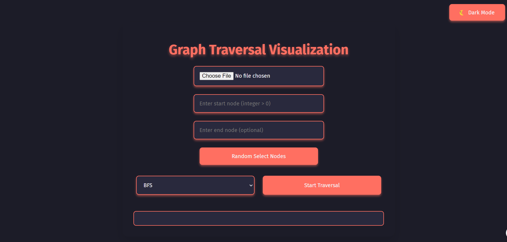

# Graph Traversal Visualization

A web application to visualize graph traversal algorithms (BFS and DFS) with an interactive interface. Users can upload an adjacency list of an undirected graph, choose a starting node, a target node, and select a traversal algorithm to visualize the traversal path.

## Live Demo

Check out the live demo [here](https://hamzeh01.github.io/graph-traversal-visualization/).

## Screenshot



## Features

- **Upload Graph**: Upload an adjacency list of an undirected graph.
- **Choose Nodes**: Select a starting node and an optional target node.
- **Traversal Algorithms**: Choose between BFS and DFS algorithms.
- **Random Selection**: Option to randomly select start and target nodes.
- **Dark/Light Mode**: Toggle between dark and light mode for better visibility.

## Installation

1. Clone the repository:

   ```sh
   git clone https://github.com/your-username/graph-traversal-visualization.git
   cd graph-traversal-visualization
   ```

2. Open `index.html` in your web browser to view the application.

## Usage

1. **Upload Graph**: Click the file input to upload an adjacency list file.
2. **Select Nodes**: Enter the start node and optionally the end node.
3. **Choose Algorithm**: Select either BFS or DFS from the dropdown.
4. **Random Select**: Click the "Random Select Nodes" button to randomly choose nodes.
5. **Start Traversal**: Click the "Start Traversal" button to visualize the traversal path.

## License

This project is licensed under the MIT License. See the [LICENSE](LICENSE) file for details.

## Contributing

Contributions are welcome! Please open an issue or submit a pull request for any improvements or bug fixes.
